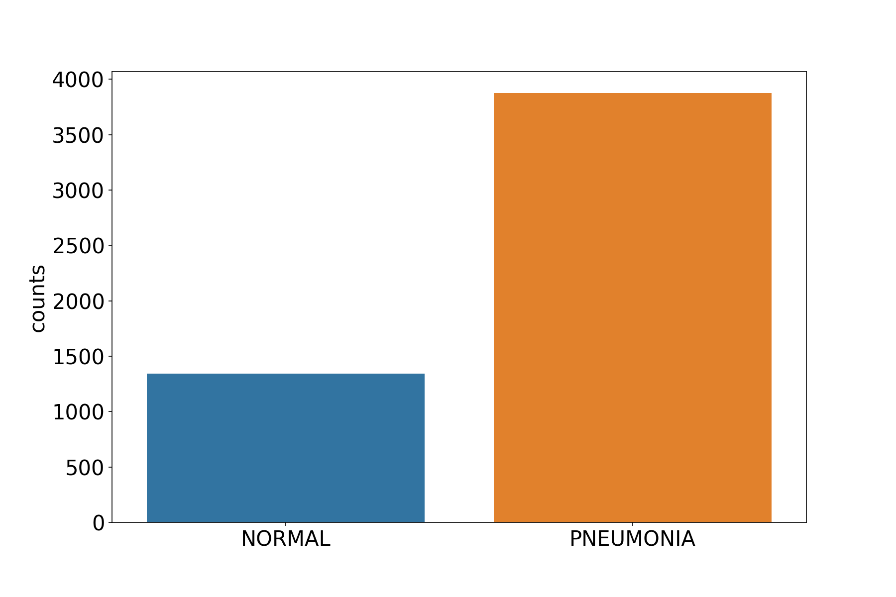

# Pneumonia detection from chest X-ray - CNN

- [Pneumonia detection from chest X-ray - CNN](#pneumonia-detection-from-chest-x-ray---cnn)
  - [About dataset](#about-dataset)
  - [Preview of some X-ray images](#preview-of-some-x-ray-images)
    - [NORMAL](#normal)
    - [PNEUMONIA](#pneumonia)
- [Model Creation](#model-creation)
  - [Accuracy and Loss during training and validation](#accuracy-and-loss-during-training-and-validation)
  - [Model metrics](#model-metrics)
- [Compare images with prediction](#compare-images-with-prediction)
  - [Normal images](#normal-images)
  - [Pneumonia images](#pneumonia-images)
- [Conclusion](#conclusion)


## About dataset

Chest X-ray images for Normal, Bacterial Pneumonia and Viral Pneumonia are published here.
http://www.cell.com/cell/fulltext/S0092-8674(18)30154-5


The dataset is divided into 3 directories.
And each folder contains subdirectories "Pneumonia" and "Normal". The number of images in the above three folders are

1. train
   - NORMAL (1341)
   - PNEUMONIA (3875)
2. test
   - NORMAL (234)
   - PNEUMONIA (390)
3. test
   - NORMAL (8)
   - PNEUMONIA (8)

It is clear that the number of train_images are not balanced. Infected images are almost three times more than the normal ones.


## Preview of some X-ray images

### NORMAL


<br>

### PNEUMONIA


# Model Creation
```
model_01 = Sequential([
            SeparableConv2D(filters = 16, kernel_size=(3,3),
                            padding = 'same',activation = 'relu',
                            input_shape = training_set.image_shape), # input shape should be image_shape
                    MaxPool2D(pool_size = (2,2)),

                    SeparableConv2D(filters = 32,
                                    kernel_size=(3,3),
                                    padding='same',activation='relu'),
                    BatchNormalization(),
                    MaxPool2D(pool_size = (2,2)),

                    SeparableConv2D(filters = 64,
                                    kernel_size=(3,3),
                                    padding='same',activation='relu'),
                    BatchNormalization(),
                    MaxPool2D(pool_size = (2,2)),

                    SeparableConv2D(filters = 128,
                                    kernel_size=(3,3),
                                    padding='same',activation='relu'),
                    BatchNormalization(),
                    MaxPool2D(pool_size = (2,2)),

                    SeparableConv2D(filters = 256,
                                    kernel_size=(3,3),
                                    padding='same',activation='relu'),
                    BatchNormalization(),
                    MaxPool2D(pool_size = (2,2)),
                    Dropout(0.2),


                    Flatten(),
                    Dense(512,activation='relu'),
                    Dropout(0.7),

                    Dense(128,activation='relu'),
                    Dropout(0.5),

                    Dense(64,activation='relu'),
                    Dropout(0.3),

                    Dense(1,activation='sigmoid')]
                    )


print(model_01.summary())

model_01.compile(loss='binary_crossentropy',
              optimizer = 'adam',
             metrics=['accuracy'])
```

## Accuracy and Loss during training and validation


<br>

## Model metrics
confusion_matrix of the model is 


    precision = tp/(tp + fp)
    recall    = tp/(tp + fn)
    f1_score = 2 * precision * recall / (precision + recall)

    Accuracy  =  91.67
    Precision =  0.92
    Recall    =  0.95
    f1-score  =  0.93

# Compare images with prediction

## Normal images


<br>

## Pneumonia images


# Conclusion
I have successfully created a model with precision = 0.92 and recall = 0.95. This model is created from scratch instead of using any transfer learning techniques.